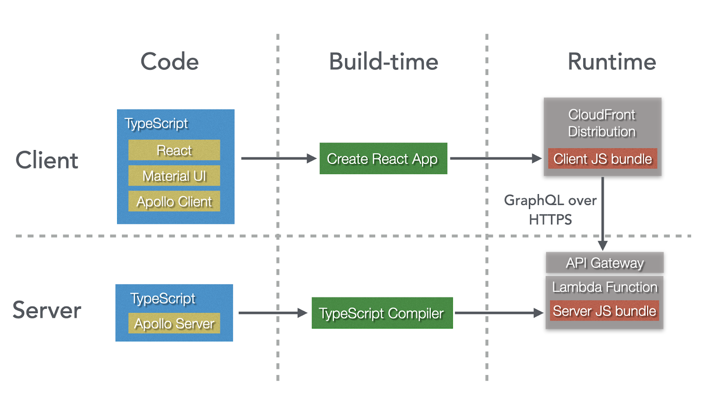

# Introduction

Over the last couple of years we have successfully built a number of web
applications that use the TGRS stack. These have been small to mid-sized
projects (up to 5-6 developers), where the team has strong JavaScript skills,
but limited DevOps experience. However, we're now at a point where we'd also be
comfortable trying it with a consumer-facing application.

The key properties of this stack are:

- The user interface comprises a React client and a GraphQL server
- TypeScript is used in both the client and server
- Serverless technologies are used to host both the client and server

This document describes these core technologies in more detail, along with how
they work together. It also mentions a few additional libraries and frameworks
that we've used successfully alongside them.

# Stack Overview

The following diagram shows the core technologies in the stack, the libraries
and tools that can be used with them, and how they relate to one another. Note
that in this example we are using AWS serverless technologies:

Whilst these technologies complement each other well, it's not necessary to use
all of them if you can't justify it, or external constraints don't permit it.
For example:

- Your app may not be big enough to justify using GraphQL instead of REST
- Your runtime environment might require you to run your own servers rather than
  using serverless technologies
- You may prefer to use Angular instead of React

If this is the case for you, it's not a massive deal - you can probably
substitute in one or two things if absolutely necessary. The only technology
that we would _not_ recommend discarding from this stack is TypeScript, as it is
the language that underpins everything, and there are no practical alternatives
to it.

# Core Technologies

We'll now drill into the core technology decisions in the stack, and the
specifics of how they are used and interact.

## TypeScript (w/ `noImplicitAny` & `strictNullChecks`)

TypeScript allows JavaScript codebases to stay manageable as they grow bigger.
It is now the dominant static type checker for JavaScript. For anything other
than the most trivial JavaScript code - be it client-side, server-side, tests or
scripting - TypeScript should be used.

Note that, to get the most out of TypeScript, it's important to enable a couple
of key flags when using it. `noImplicitAny` forces developers to be explicit
about when they want to bypass the type system, instead of it being the default
behaviour. `strictNullChecks` forces developers have to explicitly deal with
null values at compile time, rather than waiting until runtime.

Whilst these flags might appear to be minor command-line options, they both
steer the developer towards writing code that is fundamentally more reliable
than what they might have written before. This can be frustrating for developers
new to them, as they require the developer to think more about what they're
doing up-front. However, this investment pays off very quickly in the form of
fewer runtime defects and code that is easier for other developers to reason about.

## GraphQL

GraphQL makes it easy for clients to efficiently and flexibly get the data that
they need from a server. It also provides an excellent foundation for pushing as
much logic as possible from the client-side of a user interface to the
server-side, a pattern also known as
[Backend-for-Frontend](https://samnewman.io/patterns/architectural/bff/) (BFF).
With the BFF pattern, when a new feature is being added, the same developer
works on both the client and server-side code.

Whilst it's also possible to implement BFF's with REST, formal interface
definitions like [OpenAPI](https://www.openapis.org/) have to be bolted on
separately, and are only really practical to do if you are using a language like
Java. In contrast, a schema is core to any GraphQL server. Furthermore, it's
easy to write a GraphQL server in JavaScript, which makes it easy for UI
developers to treat it as an integral part of their UI. For more information on
this, see the blog post
[GraphQL: Thinking Beyond the Technology](https://shinesolutions.com/2019/11/11/graphql-thinking-beyond-the-technology/).

GraphQL's typed nature also meshes well with TypeScript. Code generators are
available that will produce TypeScript types for both GraphQL clients and
servers.

It's worth noting that GraphQL can be intimidating to newcomers at first, with
new concepts and terminology to master. For small, trivial applications, it
might be worth sticking with a REST backend. However, we've found that as soon
as your app starts to grow and evolve, GraphQL helps to keep your codebase from
descending into unmaintainable spaghetti.

Finally, this architecture proposes that you write your own GraphQL server,
rather than using services like [AppSync](https://aws.amazon.com/appsync/). This
is because AppSync is difficult to customise, which can push your application
towards patterns that actually work against the key benefits of GraphQL.

## React (w/ hooks)

React has become the dominant web framework for JavaScript. It has a simple but
powerful component model and a functional-programming mindset that is focused on
minimising state and side-effects, two of the biggest causes of bugs in user
interfaces.

The [introduction of hooks into React](https://reactjs.org/docs/hooks-intro.html)
provided an excellent mechanism for refactoring duplicated logic that is not
markup-related. For the vast majority of cases, hooks are a simpler option than
using class-based components. Our TGRS projects contain many hundreds of
hook-based functional components, but only one or two class-based components
(usually [Error Boundaries](https://reactjs.org/docs/error-boundaries.html)).

Finally, if you use hooks for managing UI state and a GraphQL client library
like [Apollo Client](https://www.apollographql.com/docs/react/) for fetching and
manipulating server-side state, then the need for state-management frameworks
like [Redux](https://redux.js.org/) disappears.

## Serverless

Serverless computing means that a cloud provider provides the server, and
automatically manages allocation of resources for that server. Whilst all major
cloud providers offer serverless products, we most commonly use AWS, which we'll
describe in more detail now.

### AWS Lambda (w/ API Gateway)

A GraphQL server can be easily and cheaply embedded in a single
[AWS Lambda](https://aws.amazon.com/lambda/) function, bypassing the need for
application servers, containers, load balancers, and all of their associated
configuration. Furthermore, because a GraphQL server only needs to expose one
HTTP endpoint, the [AWS API Gateway](https://aws.amazon.com/api-gateway/)
configuration is very straightforward.

Note that, because your lambda function must be in a public cloud to be accessed
by clients distributed via [CloudFront](https://aws.amazon.com/cloudfront/), if
you want to restrict access to certain networks, you'll have to do it via
IP whitelists. If you want to restrict access to certain users, use an identity
and access management system. And by default, AWS will enforce that all traffic
in and out of the lambda will be over HTTPS.

Finally, it's worth noting that, whilst lambdas can be extremely cheap to run,
out-of-the-box they are best suited to applications that are only subject to
low-to-medium loads. This makes them particularly ideal for in-house enterprise
applications, which often have a relatively low number of concurrent users.

If you are building a consumer-facing application with a high number of
concurrent users, you should allow extra time to test that a lambda function
will meet your performance needs without being prohibitively expensive. If it is
too expensive, you may need to introduce caching infrastructure - for example, a
CDN. If it's not scaling up fast enough, you should consider features like
[Provisioned Concurrency](https://aws.amazon.com/blogs/aws/new-provisioned-concurrency-for-lambda-functions/).

### AWS CloudFront

Even if you don't actually need the scalability of a CDN, it's still easier and
cheaper to distribute a React application using
[CloudFront](https://aws.amazon.com/cloudfront/) than to setup and manage your
own web servers, containers and load balancers. The only caveat is that, as for
lambda functions, if you only want clients from within your organisation to be
able to access the application, then you should restrict access via an IP
whitelist.

## Additional Libraries and Frameworks

In addition to the core technologies, there are number of additional tools,
libraries and frameworks that we have found work well with them.

### Material-UI (w/ JSS)

[Material-UI](https://material-ui.com/) is an implementation of Material Design
for React. For backoffice applications without super-specific user interface
requirements (i.e not consumer-facing), it is usually a great way to get a
decent-looking application up and running with minimal effort. For those
situations where you do want something more specific, it is themabl. It also has
good support for React hooks and TypeScript.

Note that, whilst Material-UI can be used with other styling solutions, it's
easiest to just stick with the default, which is
[JSS](https://github.com/cssinjs/jss).

### Create React App

[Create React App](https://github.com/facebook/create-react-app) (CRA) is a
simple "one-command" tool for packaging a React app for development, testing and
production. It hides the gory details of the underlying JavaScript transpilers
and bundlers, and now even includes built-in TypeScript support. Whilst it's
possible to "eject" a CRA project to customize the configuration of these
underlying tools, it's very unlikely you'll need to do it. We have CRA projects
that have been going for several years that we haven't had to eject yet.

### Apollo Client

[Apollo Client](https://www.apollographql.com/docs/react/) is a GraphQL client
that can be used with React. It includes smarts for querying and caching data,
and is a great way to get started building your first GraphQL client.
Furthermore, when used in-conjunction with TypeScript and a code-generator like
that built into [Apollo CLI](https://www.apollographql.com/docs/devtools/cli/),
the types of all query-related code can be checked at compile-time.

### Apollo Server

[Apollo Server](https://www.apollographql.com/docs/apollo-server) is a GraphQL
server library that makes it easy to build your own GraphQL server in
TypeScript. It comes with shims for running a GraphQL server in different
environments. This means you can run it in both an AWS Lambda function, which is
great for production releases, or an Express server, which is better for
day-to-day development and testing. For more information on doing this, see the
blog post
[Building a Portable Apollo Server](https://shinesolutions.com/2020/07/22/building-a-portable-apollo-server-config/).

Apollo Server also introduces the
[data source](https://www.apollographql.com/docs/apollo-server/data/data-sources/)
pattern for structuring your application. Data sources encapsulate fetching the
data for a particular service. They can also be composed. We recommend you push
as much logic as possible out of your resolvers and into your datasources.

Finally, we recommend using
[GraphQL Code Generator](https://graphql-code-generator.com/) and its
[TypeScript](https://graphql-code-generator.com/docs/plugins/typescript) and
[TypeScript Resolvers](https://graphql-code-generator.com/docs/plugins/typescript-resolvers)
plugins to automatically generate types for your Apollo Server resolvers from
your GraphQL schema.

# Conclusion

We've found that TypeScript, GraphQL, React and serverless technologies provide
a great combination of code-quality and day-to-day agility. Furthermore, in
practice we've found them to work really well with tools and frameworks like
Material-UI, Apollo and Create React App. Our experience has been that, once the
foundation is set up, it's easy to add new functionality, whilst still keeping
the codebase manageable. Furthermore, for apps receiving only low-to-medium
loads (which is often the case with enterprise applications), running everything
on serverless infrastructure keeps costs very low. In short, we think that these
technologies will let you be productive right now, but also keep you pointed in
the direction that web development is heading towards in the future.
